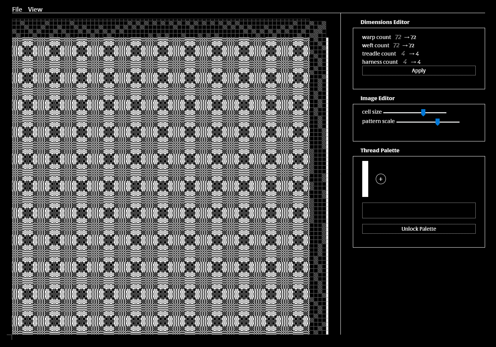

# Woven Images
Woven Images is a web app for viewing and crafting drafts for woven patterns. Includes many presets to play around with.
Built with TypeScript, React, and ThreeJS.

## How to use

Some instructions are provided on the site itself for how to get started using this application

## Future development plans

0. Develop domain-specific language for creating loom drafts (in progress)
1. Resolve UX issues with thread palette color picker (updates) (in progress)
2. Thread width implemented in fragment shader (low priority)
3. Repetition support for treadling instructions (working on solution to this)
5. Filters for draft inputs (in progress)
	a. shifting (done!)
	b. applying noise
	c. markov chains
6. More expressive Thread Palette editor
	a. animations
	b. patterns
	c. gradients
6. Improve dimension editing to add or remove any column or row
8. Box select and move selections
9. Allow deleting treadles and threads 
10. Add history/undo capabilities
